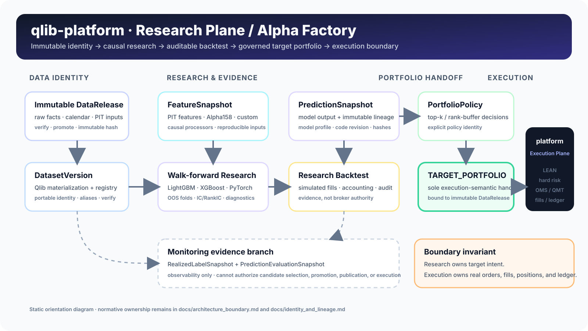

<div align="center">


### Auditable A-share Quant Research & Alpha Factory on Microsoft Qlib

**Immutable data lineage · PIT-aware research · Walk-forward evaluation · Reproducible Qlib workflows · Governed portfolio handoff**

<p>
  <a href="https://github.com/magic-alt/qlib-platform/actions/workflows/ci.yml"></a>
  <a href="https://github.com/magic-alt/qlib-platform/actions/workflows/docs.yml"></a>
  <a href="https://github.com/magic-alt/qlib-platform/actions/workflows/codeql.yml"></a>
  <a href="LICENSE"></a>
  
  
  
  
</p>

[Quick Start](#quick-start) · [Architecture](#architecture) · [Documentation](docs/index.md) · [CLI Reference](docs/cli_reference.md) · [Roadmap](docs/project/roadmap.md) · [Contributing](CONTRIBUTING.md) · [Changelog](CHANGELOG.md)

</div>

> [!IMPORTANT]
> `qlib-platform` is a **Research Plane**, not a broker execution engine. It does not submit, cancel, or replace real broker orders and does not own broker state. The only cross-repository execution handoff is a `TARGET_PORTFOLIO` bound to an immutable `DataRelease`.

`qlib-platform` 是一个面向 A 股量化研究的 **Research Plane / Alpha Factory**。项目以 [Microsoft Qlib](https://github.com/microsoft/qlib) 为核心研究引擎，把数据发布、DatasetVersion 物化、PIT 特征、模型研究、walk-forward、组合构建、研究审计和 artifact 交付组织成一条**可追踪、可复现、可验证**的研究流水线。

It can run as a standalone research platform or hand governed research artifacts to [`magic-alt/platform`](https://github.com/magic-alt/platform), the optional **Execution Plane** responsible for authoritative execution semantics, hard risk, OMS, QMT/broker integration, orders, fills, positions and ledger state.

---

## Why qlib-platform

A successful backtest is not enough for production-grade quantitative research. A research platform must also answer:

- **Which exact data release was used?** Raw data, adjustment rules, calendars and PIT inputs must have stable identity.
- **Can the experiment be reproduced?** Dataset, features, labels, splits, model profile, code revision and portfolio policy must be pinned.
- **Can a result be audited independently?** Research evidence, simulated fills and strategy decisions should be replayable and verifiable.
- **Was the holdout really sealed?** Diagnostics, candidate generation, model selection and holdout access must be governed as different lifecycle stages.
- **Where does research end and execution begin?** Target portfolios can cross the boundary; live broker state cannot.

`qlib-platform` therefore focuses on **quant research engineering**, not merely another wrapper around `qrun`.

### What makes it different

| Principle | What it means in this repository |
| --- | --- |
| **Immutable by construction** | `DataRelease`, `DatasetVersion`, feature/prediction snapshots and research artifacts carry explicit identity and lineage. |
| **Walk-forward first** | Time-series research is organized around governed OOS evaluation rather than a single random train/test split. |
| **Policy is explicit** | Portfolio construction is a typed research stage (`topk_dropout_v1`, `rank_buffer_v1`, etc.), not hidden ad-hoc logic. |
| **Evidence over claims** | IC/RankIC, stability, regime, attribution, backtest audit and validation artifacts are first-class outputs. |
| **Research/execution separation** | Research may publish a target portfolio; broker orders, fills, positions and ledger remain outside this repository. |
| **Standalone by default** | Local research does not require `platform`, QMT or a TuShare credential unless the selected workflow actually needs them. |

---

## Architecture

<p align="center">
  
</p>

The diagram is an orientation view. Normative ownership and identity rules live in [Architecture Overview](docs/architecture.md), [Architecture Boundary](docs/architecture_boundary.md) and [Identity and Lineage](docs/identity_and_lineage.md).

### Research Plane — this repository

- DataRelease build / import / verify / promote
- immutable Qlib DatasetVersion materialization and registry
- PIT-aware data, Alpha158/custom handlers and feature snapshots
- LightGBM, XGBoost and optional PyTorch model research
- walk-forward, IC, RankIC, stability, regime and attribution analysis
- Qlib research backtests and strategy audit
- `PortfolioPolicy` and `TARGET_PORTFOLIO` construction
- `MODEL_RELEASE`, `SIGNAL_SNAPSHOT`, `VALIDATION_RESULT` and related research artifacts
- Artifact Contract v2 export, durable outbox and acknowledgement tracking
- research promotion up to `RESEARCH_PROMOTED`

### Execution Plane — `magic-alt/platform`

- authoritative LEAN backtest / execution semantics
- hard risk and execution controls
- paper / shadow / production trading
- OMS and QMT / broker gateway
- orders, fills, positions and ledger
- `LEAN_VALIDATED`, `PAPER`, `PRODUCTION`, `RETIRED`

---

## Quick start

### Requirements

- Python `>=3.10,<3.13`
- recommended local interpreter: **Python 3.12**
- `pyqlib==0.9.7` when using the Qlib extra
- Windows, Linux or macOS

### Linux / macOS

```bash
git clone https://github.com/magic-alt/qlib-platform.git
cd qlib-platform

python3.12 -m venv .venv
RepoPython=.venv/bin/python
$RepoPython -m pip install --upgrade pip
$RepoPython -m pip install -c constraints/ci.txt -e '.[dev]'

$RepoPython -m tushare_qlib status
$RepoPython -m tushare_qlib health dependencies
$RepoPython -m tushare_qlib release list
```

### Windows PowerShell

```powershell
git clone https://github.com/magic-alt/qlib-platform.git
cd qlib-platform

python3.12 -m venv .venv
$RepoPython = '.\.venv\Scripts\python.exe'
& $RepoPython -m pip install --upgrade pip
& $RepoPython -m pip install -c constraints/ci.txt -e ".[dev]"

& $RepoPython -m tushare_qlib status
& $RepoPython -m tushare_qlib health dependencies
& $RepoPython -m tushare_qlib release list
```

The CLI defaults to `configs/pipeline.standalone.yaml`. The standalone profile intentionally avoids external startup dependencies.

> [!TIP]
> New to the repository? Continue with the maintained [local Qlib backtest example](examples/local_qlib_backtest/README.md). For command syntax and side-effect classification, use the dedicated [CLI Reference](docs/cli_reference.md).

### Optional environment configuration

Copy `.env.example` only when a workflow needs custom data roots or external data access:

```bash
cp .env.example .env
```

Common variables:

```text
QLIB_DATA_ROOT=/absolute/path/to/qlib-platform-data
TUSHARE_TOKEN=...              # optional; only for TuShare downloads
QUANT_DATA_ROOT=...            # optional; integrated mode
DATASET_RELEASE_ID=...         # optional; integrated mode
```

Never commit secrets or token values.

---

## Core workflow

```text
DataRelease
    -> materialize
DatasetVersion
    -> FeatureSnapshot
    -> research / walk-forward
    -> PredictionSnapshot / MODEL_RELEASE
    -> research backtest + audit
    -> PortfolioPolicy
    -> TARGET_PORTFOLIO
    -> Artifact Contract v2
    -> optional platform handoff
```

The central invariant is simple: **research must never silently change the identity of its inputs**.

Two identifiers that must not be confused:

- `release verify` verifies a **DataRelease**;
- `dataset-verify` verifies a **DatasetVersion** or dataset reference;
- `live-inference --dataset-ref` accepts a DatasetVersion ID or alias, not a DataRelease ID.

Changing data, features, labels, split rules, model profile, portfolio policy or implementation identity creates a new research identity rather than mutating existing evidence.

---

## Capabilities

| Area | Highlights |
| --- | --- |
| **Data release** | immutable release build/import/verify/promote, local or external inputs |
| **Dataset lifecycle** | materialization, registry, aliases, verification and migration |
| **Feature engineering** | Qlib handlers, Alpha158, custom features, feature snapshots, PIT fundamentals |
| **Model research** | LightGBM, XGBoost, optional PyTorch, explicit model profiles |
| **Research protocol** | fixed and walk-forward OOS studies, governed diagnostics and research runs |
| **Evaluation** | IC, RankIC, stability, regime, attribution, explanation and prediction feedback |
| **Backtesting** | Qlib research backtest, simulated fills, audit and reporting |
| **Portfolio construction** | `topk_dropout_v1`, `rank_buffer_v1`, target portfolio generation |
| **Artifact governance** | Artifact Contract v2, validation, promotion and portable evidence |
| **Operations** | health checks, runtime probes, outbox, recovery and observability |
| **Execution handoff** | DataRelease-bound `TARGET_PORTFOLIO` to optional `magic-alt/platform` |

### Installation profiles

| Extra | Purpose |
| --- | --- |
| `data` | TuShare / MySQL-oriented ingestion helpers |
| `qlib` | `pyqlib==0.9.7` + LightGBM |
| `xgboost` | XGBoost research |
| `pytorch` | PyTorch research |
| `all` | data + Qlib + LightGBM + XGBoost |
| `dev` | tests, lint, typing and research dependencies |
| `docs` | MkDocs Material documentation-site tooling |

Examples:

```bash
# Full research environment
$RepoPython -m pip install -e '.[all,dev]'

# Add PyTorch to the governed development environment
$RepoPython -m pip install -c constraints/ci.txt -e '.[dev,pytorch]'

# Build the documentation site
$RepoPython -m pip install -e '.[docs]'
$RepoPython -m mkdocs build --strict
```

See [Configuration](docs/configuration.md) for canonical dependency and profile rules.

---

## Deployment modes

| Profile | Use case | External platform | TuShare |
| --- | --- | ---: | ---: |
| `configs/pipeline.standalone.yaml` | autonomous local research; **default** | No | only for downloads |
| `configs/pipeline.integrated.yaml` | consume an external immutable DataRelease | Yes | No |
| `configs/pipeline.yaml` | integrated canonical/base config | Yes | No |
| `configs/pipeline_phase2.yaml` | frozen governed Phase 2/3 profile | depends on release | No |
| `configs/pipeline_tushare_dev.yaml` | TuShare development | No | Yes |
| `configs/pipeline_lean_mysql.yaml` | legacy migration compatibility | legacy source | No |

Do not treat `pipeline.yaml` as a universal default. Select integrated mode explicitly when the workflow consumes an external DataRelease.

---

## Research governance

Formal research separates diagnostics, candidate creation, model selection, final holdout access and publishing into distinct lifecycle stages. The active authorization state is intentionally **not duplicated in this README** because it changes over time.

**Before governed research, read → [Current Governance State](docs/current_state.md)**

That page is the source of truth for reviewed/certified baselines, active research phase, holdout state, publishing authorization and the current documentation-audit base.

> [!CAUTION]
> Generic CLI availability does not override active governance restrictions. A command existing in the parser does not mean the current research program authorizes it.

---

## Project layout

```text
qlib-platform/
├─ configs/                 # runtime, research, model and portfolio profiles
├─ constraints/             # CI/dev dependency constraints
├─ contracts/               # Artifact Contract schemas
├─ deploy/                  # systemd / launchd deployment assets
├─ docs/                    # architecture, lifecycle, operations and research docs
├─ examples/                # maintained runnable examples
├─ scripts/                 # validation and utility scripts
├─ src/tushare_qlib/        # application and research implementation
├─ tests/                   # unit / integration / contract tests
├─ .github/                 # CI, security, release and community automation
├─ .env.example             # environment-variable template
├─ AGENTS.md                # guidance for coding agents
├─ CHANGELOG.md             # user-visible software changes and release baseline
├─ CODE_OF_CONDUCT.md       # collaboration and research-integrity policy
├─ CONTRIBUTING.md          # contributor workflow and validation rules
├─ LICENSE                  # Apache License 2.0
├─ SECURITY.md              # vulnerability reporting policy
├─ mkdocs.yml               # documentation-site configuration
├─ pyproject.toml           # package metadata and dependency profiles
└─ README.md
```

---

## Documentation

The canonical entry point is the **[Documentation Index](docs/index.md)**.

| Start here | Use it for |
| --- | --- |
| [Current State](docs/current_state.md) | active governance facts and authorization state |
| [Architecture](docs/architecture.md) | system layers, data flow, deployment modes and failure model |
| [Architecture Boundary](docs/architecture_boundary.md) | Research Plane / Execution Plane ownership |
| [Identity and Lineage](docs/identity_and_lineage.md) | immutable identities and parent/child relationships |
| [Configuration](docs/configuration.md) | profiles, environment variables and dependency extras |
| [CLI Reference](docs/cli_reference.md) | commands, side effects and key parameters |
| [Research Lifecycle](docs/research_lifecycle.md) | governed research stages |
| [Operations Runbook](docs/OPERATIONS_RUNBOOK.md) | operational procedures and recovery entry points |
| [Testing and Certification](docs/testing_and_certification.md) | validation and certification model |
| [Roadmap](docs/project/roadmap.md) | public engineering direction and milestone criteria |
| [Release Process](docs/maintainers/releasing.md) | software versioning, release notes and rollback |
| [Repository Governance](docs/maintainers/repository-governance.md) | Ruleset, dependency, security and supply-chain policy |
| [Brand Guide](docs/maintainers/branding.md) | logo, palette, typography and diagram policy |
| [Troubleshooting](docs/troubleshooting.md) | common failures and recovery guidance |

Historical protocols and deprecated tutorials live under [`docs/history`](docs/history/README.md) and must not be treated as current operating instructions.

---

## Development

Before opening a pull request, run the repository checks with the repository interpreter:

```bash
$RepoPython scripts/check_docs.py --root .
$RepoPython -m ruff check src tests
$RepoPython -m ruff format --check src tests
$RepoPython -m mypy src
$RepoPython -m tushare_qlib --config configs/pipeline.integrated.yaml validate-qrun-contract
$RepoPython -m pytest
```

Coverage:

```bash
$RepoPython -m pytest --cov=src/tushare_qlib --cov-report=term-missing
```

See [CONTRIBUTING.md](CONTRIBUTING.md) for contributor onboarding, change classification, validation expectations and pull-request guidance.

---

## Relationship to Microsoft Qlib

`qlib-platform` **uses and extends Qlib; it is not a fork or replacement of Qlib**.

Microsoft Qlib provides the underlying quantitative ML framework, dataset interfaces, models, strategies, records and backtest machinery. This repository adds an A-share research-engineering layer around it: immutable data releases, dataset identity, PIT-aware research inputs, governed research lifecycle, explicit portfolio policy, independent auditing, artifact contracts and a hard research/execution boundary.

Upstream: [microsoft/qlib](https://github.com/microsoft/qlib)

---

## Contributing & community

Contributions that improve reproducibility, data integrity, research tooling, documentation, testing or operational safety are welcome. New contributors should start with [CONTRIBUTING.md](CONTRIBUTING.md) and the [Good First Issue guide](docs/project/good-first-issues.md).

Participation is governed by the [Code of Conduct](CODE_OF_CONDUCT.md). For suspected vulnerabilities, credential exposure, artifact-integrity bypasses or security-boundary issues, follow [SECURITY.md](SECURITY.md) instead of opening a public issue.

Software release history is tracked in [CHANGELOG.md](CHANGELOG.md); maintainer release procedure lives in [docs/maintainers/releasing.md](docs/maintainers/releasing.md).

---

## License

Licensed under the [Apache License 2.0](LICENSE). Third-party projects, datasets and dependencies retain their own licenses and attribution requirements.

---

## Disclaimer

This repository is research and engineering software. Backtests, model scores, diagnostics, target portfolios and generated artifacts are **not investment advice** and do not guarantee future performance.
