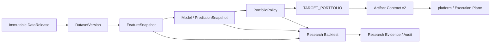

# qlib-platform

> Auditable A-share research / alpha factory built around immutable data lineage, reproducible Qlib workflows, and an explicit boundary between research and execution.

`qlib-platform` 是一个面向 A 股量化研究的 **Research Plane / Alpha Factory**。项目以 Microsoft Qlib 为核心研究引擎，把数据发布、数据集物化、特征、模型、walk-forward、组合构建、研究审计和 artifact 交付组织成一条可追踪、可复现、可验证的研究流水线。

它既可以作为独立研究平台运行，也可以通过 **Artifact Contract v2** 与 [`magic-alt/platform`](https://github.com/magic-alt/platform) 对接。后者是可选的 **Execution Plane**，负责权威执行语义、hard risk、OMS、QMT/券商、订单、成交与 ledger。

> **重要边界：** 本仓库不提交、撤销或替换真实 broker order，也不维护 broker state。跨仓库唯一具有执行语义的 handoff 是绑定到一个不可变 `DataRelease` 的 `TARGET_PORTFOLIO`。

---

## Why this project

传统量化研究脚本通常能回答“这个模型历史上赚了多少”，但很难稳定回答下面这些问题：

- 这次实验到底使用了哪一版原始数据、复权规则和交易日历？
- 特征、标签、训练集、验证集和 holdout 是否严格绑定到不可变输入？
- 两次回测结果不一致时，差异来自数据、代码、模型还是组合策略？
- 一个研究结果什么时候只是 exploratory result，什么时候可以进入受治理的 promotion 流程？
- 研究代码如何与真实交易系统隔离，又如何安全地把目标组合交给执行层？

`qlib-platform` 的目标不是再封装一层简单的 `qrun`，而是把 **quant research engineering** 中最容易失控的部分——数据身份、研究 lineage、实验生命周期、策略审计和跨系统 handoff——变成显式的一等公民。

### Core design goals

- **Immutable data lineage** — `DataRelease`、`DatasetVersion`、Feature/Prediction Snapshot 等对象拥有明确身份和 lineage。
- **Reproducible research** — 研究运行固定数据、配置、代码 revision、模型 profile 和 portfolio policy。
- **Walk-forward first** — 面向真实时间序列研究，而不是只依赖随机切分或单次 train/test。
- **Research governance** — 把 diagnostics、candidate、selection、holdout、promotion 等阶段分开管理。
- **Auditability** — 研究 backtest、组合决策和 artifact 输出可以独立验证。
- **Execution isolation** — Research Plane 不持有真实订单、成交、持仓或券商账本语义。
- **Standalone by default** — 不依赖 `platform`、QMT 或 TuShare 即可启动本地研究环境。

---

## Architecture



### Research Plane — owned by this repository

`qlib-platform` 负责：

- 本地、TuShare 或外部 `DataRelease` 的研究数据入口；
- Qlib DatasetVersion 物化与 dataset registry；
- PIT-aware 数据、特征与 factor research；
- Alpha158 / 自定义 handler / feature store；
- LightGBM、XGBoost、PyTorch 等模型研究；
- walk-forward、IC、RankIC、stability、regime 与 attribution 分析；
- Qlib research backtest；
- `PortfolioPolicy` 与 `TARGET_PORTFOLIO` 构建；
- `MODEL_RELEASE`、`SIGNAL_SNAPSHOT`、`VALIDATION_RESULT` 等研究 artifact；
- Artifact Contract v2 export 与 durable outbox；
- promotion 最多推进到 `RESEARCH_PROMOTED`。

### Execution Plane — owned by `platform`

真实执行侧包括：

- authoritative LEAN backtest / execution semantics；
- hard risk；
- paper / shadow / production trading；
- OMS；
- QMT / broker gateway；
- orders / fills / positions / ledger；
- `LEAN_VALIDATED`、`PAPER`、`PRODUCTION`、`RETIRED` 等执行生命周期。

完整规范见 [Architecture Boundary](docs/architecture_boundary.md) 和 [Identity and Lineage](docs/identity_and_lineage.md)。

---

## Capabilities

| Area | What the repository provides |
| --- | --- |
| Data release | immutable `DataRelease` build / import / verify / promote |
| Dataset lifecycle | materialization, registry, alias, verification, migration |
| Feature engineering | Qlib handlers, Alpha158, custom features, feature snapshots |
| Model research | LightGBM, XGBoost, optional PyTorch, model profiles |
| Research protocol | walk-forward, diagnostics, governed research runs |
| Evaluation | IC, RankIC, stability, regime, attribution, prediction feedback |
| Backtesting | Qlib research backtest, simulated fills, backtest audit/report |
| Portfolio construction | `topk_dropout_v1`, `rank_buffer_v1`, target portfolio generation |
| Artifact governance | Artifact Contract v2, validation, promotion, portable evidence |
| Operations | health checks, runtime probes, outbox, recovery and observability |
| Deployment boundary | research artifact handoff to optional `magic-alt/platform` |

---

## Requirements

- Python `>=3.10,<3.13`
- Recommended local interpreter: **Python 3.12**
- `pyqlib==0.9.7`
- `lightgbm==4.6.0` when the Qlib extra is installed

The repository supports Windows, Linux and macOS development. Production/research machines should use an isolated repository-local virtual environment.

---

## Quick start

### 1. Clone and create a virtual environment

#### Windows PowerShell

```powershell
git clone https://github.com/magic-alt/qlib-platform.git
cd qlib-platform

python3.12 -m venv .venv
$RepoPython = '.\.venv\Scripts\python.exe'
& $RepoPython -m pip install --upgrade pip
& $RepoPython -m pip install -c constraints/ci.txt -e ".[dev]"
```

#### Linux / macOS

```bash
git clone https://github.com/magic-alt/qlib-platform.git
cd qlib-platform

python3.12 -m venv .venv
RepoPython=.venv/bin/python
$RepoPython -m pip install --upgrade pip
$RepoPython -m pip install -c constraints/ci.txt -e '.[dev]'
```

### 2. Optional environment configuration

The default standalone profile does not require external services. Copy `.env.example` only when you need custom data roots or external data access.

```bash
cp .env.example .env
```

Common variables include:

```text
QLIB_DATA_ROOT=/absolute/path/to/qlib-platform-data
TUSHARE_TOKEN=...              # optional; only for TuShare downloads
QUANT_DATA_ROOT=...            # optional; integrated mode
DATASET_RELEASE_ID=...         # optional; integrated mode
```

Never commit secrets or token values.

### 3. Verify the installation

Use the repository interpreter explicitly for governed operations:

```powershell
& $RepoPython -m tushare_qlib status
& $RepoPython -m tushare_qlib health dependencies
& $RepoPython -m tushare_qlib release list
```

Linux / macOS:

```bash
$RepoPython -m tushare_qlib status
$RepoPython -m tushare_qlib health dependencies
$RepoPython -m tushare_qlib release list
```

The CLI default profile is:

```text
configs/pipeline.standalone.yaml
```

It is intentionally standalone: `platform` is not a startup dependency and TuShare is required only for workflows that actually download TuShare data.

---

## Installation profiles

The base package contains the platform infrastructure. Optional dependencies enable specific research workloads.

| Extra | Purpose |
| --- | --- |
| `data` | TuShare / MySQL-oriented data ingestion helpers |
| `qlib` | `pyqlib==0.9.7` + LightGBM |
| `xgboost` | XGBoost research |
| `pytorch` | PyTorch research |
| `all` | data + Qlib + LightGBM + XGBoost |
| `dev` | development, tests, lint, typing and research dependencies |

Examples:

```powershell
# Normal development environment
& $RepoPython -m pip install -c constraints/ci.txt -e ".[dev]"

# Full research environment
& $RepoPython -m pip install -e ".[all,dev]"

# Add PyTorch
& $RepoPython -m pip install -c constraints/ci.txt -e ".[dev,pytorch]"
```

See [Configuration](docs/configuration.md) for the canonical dependency and profile rules.

---

## Configuration profiles

| Profile | Purpose | External platform | TuShare |
| --- | --- | ---: | ---: |
| `configs/pipeline.standalone.yaml` | autonomous local research; default | No | only for downloads |
| `configs/pipeline.integrated.yaml` | consume an external immutable DataRelease | Yes | No |
| `configs/pipeline.yaml` | integrated canonical/base config | Yes | No |
| `configs/pipeline_phase2.yaml` | frozen governed Phase 2/3 profile | depends on release | No |
| `configs/pipeline_tushare_dev.yaml` | TuShare development | No | Yes |
| `configs/pipeline_lean_mysql.yaml` | legacy migration compatibility | legacy source | No |

Do not treat `pipeline.yaml` as a universal default. If a command requires an external DataRelease, select `pipeline.integrated.yaml` explicitly.

---

## Identity and lineage

The central invariant is that research never silently changes the identity of its inputs.

```text
DataRelease
    -> materialize
DatasetVersion
    -> FeatureSnapshot
    -> PredictionSnapshot / MODEL_RELEASE
    -> PortfolioPolicy
    -> TARGET_PORTFOLIO
    -> Artifact Contract v2
    -> platform
```

Two identifiers that must not be confused:

- `release verify` verifies a **DataRelease**;
- `dataset-verify` verifies a **DatasetVersion** or dataset reference;
- `live-inference --dataset-ref` accepts a DatasetVersion ID or alias, **not** a DataRelease ID.

Governed evidence records the relevant data identity, feature/alpha definition, label and split specification, model profile, portfolio policy, code revision and implementation hashes. Changing one of those inputs creates a new research identity instead of mutating existing evidence.

Read [Identity and Lineage](docs/identity_and_lineage.md) for the normative rules.

---

## Typical workflows

### A. Standalone local research

Use the default profile when the machine owns its local research data lifecycle.

```bash
$RepoPython -m tushare_qlib status
$RepoPython -m tushare_qlib dataset-list
$RepoPython -m tushare_qlib dataset-resolve <DATASET_REF>
```

After resolving an immutable DatasetVersion, run research with explicit configuration and output locations.

### B. Integrated research

When research consumes a DataRelease produced by the external platform:

```bash
$RepoPython -m tushare_qlib \
  --config configs/pipeline.integrated.yaml \
  release verify <RELEASE_ID>
```

The release is then materialized into a repository-owned DatasetVersion before Qlib research begins. Downstream workflows bind to the DatasetVersion, rather than passing mutable workstation paths between commands.

### C. Qlib / qrun tutorial

For a minimal local Qlib workflow, use the maintained example:

[examples/local_qlib_backtest](examples/local_qlib_backtest/README.md)

The important rule is that `QLIB_DATA_URI` should resolve from an immutable DatasetVersion. Production workflows should not hard-code developer workstation paths into Qlib YAML.

### D. Governed research

Formal research uses `research-run` and explicit immutable inputs. Diagnostics, candidate generation, model selection, holdout access and publishing are intentionally separate lifecycle stages.

The currently authorized research phase is a **dynamic governance fact** and therefore lives only in [Current State](docs/current_state.md), not in this README.

---

## CLI overview

Invoke the CLI as:

```text
<repo-python> -m tushare_qlib [--config PROFILE] COMMAND
```

A `tq` console entry point is installed as well, but using the explicit repository interpreter is preferred for governed runs because it prevents accidentally invoking a global executable.

### Read-only / validation-first commands

```text
status
health live
health ready
health dependencies
runtime-probe
release list
release verify
dataset-list
dataset-show
dataset-resolve
dataset-verify
model-status
ops-query
ops-summary
validate-qrun-contract
project-audit
research-audit
```

### Research artifact commands

Examples include:

```text
feature-store
train-select
research-run
backtest-predictions
research-report
alpha-diagnose
regime-diagnose
attribution-diagnose
explanation-diagnose
build-target-portfolio
research-gate
artifact-v2-export
```

Some validation or research commands write immutable evidence. Treat an explicitly named output path as part of the authorized operation.

For the complete command classification, see [CLI Reference](docs/cli_reference.md).

---

## Portfolio policy layer

Portfolio construction is not hidden inside ad-hoc backtest code. It is a first-class, policy-typed research stage.

Currently documented policies include:

- `topk_dropout_v1` — Qlib-native `TopkDropoutStrategy`;
- `rank_buffer_v1` — repository implementation with independent target-size and entry-rank controls.

The selected policy is recorded in research manifests, and strategy audit replays the same decision function against simulated Qlib fills.

See [Portfolio Policy Layers](docs/portfolio_v2_rank_buffer.md).

---

## Project layout

```text
qlib-platform/
├─ configs/                 # runtime, research, model and portfolio profiles
├─ constraints/             # dependency constraints used by CI/dev setup
├─ contracts/               # Artifact Contract schemas
├─ deploy/                  # systemd / launchd deployment assets
├─ docs/                    # architecture, lifecycle, operations and research docs
├─ examples/                # maintained runnable examples
├─ scripts/                 # repository validation / utility scripts
├─ src/tushare_qlib/        # application and research implementation
├─ tests/                   # unit / integration / contract tests
├─ .env.example             # environment-variable template
├─ AGENTS.md                # repository guidance for coding agents
├─ pyproject.toml            # package metadata and dependency profiles
└─ README.md
```

Major implementation areas under `src/tushare_qlib/` include data release and registry management, feature store, alpha registry, Qlib handlers and strategies, model lifecycle, research runners, backtest audit/reporting, portfolio construction, artifact export, feedback evaluation, health and operations tooling.

---

## Development and validation

Before merging changes, run the repository checks using the repository interpreter.

```powershell
& $RepoPython scripts/check_docs.py --root .
& $RepoPython -m ruff check src tests
& $RepoPython -m ruff format --check src tests
& $RepoPython -m mypy src
& $RepoPython -m tushare_qlib --config configs/pipeline.integrated.yaml validate-qrun-contract
& $RepoPython -m pytest
```

Coverage can also be checked with:

```bash
$RepoPython -m pytest --cov=src/tushare_qlib --cov-report=term-missing
```

The repository also contains a Makefile, but governed operations should still prefer the repository-local interpreter and explicit configuration profile so that a global `python`, `tq` or `qrun` cannot silently change the runtime identity.

---

## Operational safety

Commands such as the following change state or create durable evidence and should be run only with explicit input/output scope:

```text
backfill / sync-* / daily-sync
stage-* / dump-*
release build-* / release promote
dataset-build / dataset-promote
model-refit / model-deploy / model-rollback
live-inference / daily-signal-run
artifact-v2-export
phase3-diagnose
outbox drain / outbox worker
scheduled-task installation or removal
```

The exact classification evolves with the CLI. Use [CLI Reference](docs/cli_reference.md) and [Operations Runbook](docs/OPERATIONS_RUNBOOK.md) as the operational source of truth.

---

## Current governance state

README intentionally does **not** duplicate commit baselines, certification claims, active research phase, holdout state or publishing authorization. Those values change over time and have one canonical location:

**→ [Current State](docs/current_state.md)**

Use that page before performing governed research, promotion, portable evidence export or integration handoff.

---

## Documentation

Start with the [Documentation Index](docs/index.md).

### Architecture and contracts

- [Architecture Overview](docs/architecture.md)
- [Architecture Boundary](docs/architecture_boundary.md)
- [Identity and Lineage](docs/identity_and_lineage.md)
- [Artifact Contract v2](docs/artifact_contract_v2.md)
- [Configuration](docs/configuration.md)
- [CLI Reference](docs/cli_reference.md)
- [Glossary](docs/glossary.md)

### Data and research

- [Qlib Data Platform](docs/qlib_data_platform.md)
- [Data Schema](docs/data_schema.md)
- [Research Lifecycle](docs/research_lifecycle.md)
- [Alpha Research Phase 3](docs/alpha_research_phase_3.md)
- [Portfolio Policy Layers](docs/portfolio_v2_rank_buffer.md)
- [Local qrun Example](examples/local_qlib_backtest/README.md)

### Operations and validation

- [Operations Runbook](docs/OPERATIONS_RUNBOOK.md)
- [Model Lifecycle](docs/model_lifecycle.md)
- [Testing and Certification](docs/testing_and_certification.md)
- [Troubleshooting](docs/troubleshooting.md)

Historical protocols, completed research phases and deprecated tutorials live under [docs/history](docs/history/README.md) and must not be treated as current operating instructions.

---

## Relationship to Microsoft Qlib

This repository **uses and extends Qlib; it is not a fork or replacement of Qlib**.

Qlib provides the underlying quantitative ML research framework, dataset interfaces, models, strategies, records and backtest machinery. `qlib-platform` adds a repository-specific A-share research engineering layer around it: immutable data releases, dataset identity, governed research lifecycle, portfolio policy, auditing, artifact contracts and an explicit research/execution boundary.

Upstream project: [microsoft/qlib](https://github.com/microsoft/qlib)

---

## Disclaimer

This repository is research and engineering software. Backtests, model scores, diagnostics, target portfolios and generated artifacts are not investment advice and do not guarantee future performance.
