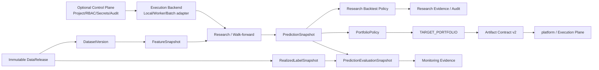

# Architecture

`qlib-platform` is the Research Plane / Alpha Factory. It owns reproducible research from immutable data input through target-portfolio publication, while the sibling `magic-alt/platform` owns authoritative execution semantics. An optional institutional control plane can govern multi-user access and dispatch research work without becoming a second Qlib research engine.

## System view


The static overview above is an onboarding aid. The Mermaid graph below remains close to the normative concepts and is easier to keep aligned with textual architecture changes.



The feedback branch is deliberately a side branch. `RealizedLabelSnapshot` and `PredictionEvaluationSnapshot` are monitoring evidence; they do not sit on the promotion path and cannot authorize candidate selection, deployment or publication.

## Logical layers

| Layer | Responsibility | Representative implementation |
| --- | --- | --- |
| Institutional control plane (optional) | project isolation, RBAC, secret refs, artifact metadata, entitlement, quota, approval/audit | `control_plane/`, `auth/`, `research/management/` |
| Execution backend | scheduler-neutral delivery, business-run idempotency, cancel/resume and worker semantics | `control_plane/execution.py`, existing local/systemd/parallel adapters |
| Release intake | publish/import/verify immutable upstream facts | `releases/`, `data_release.py` |
| Dataset materialization | convert a release into an immutable Qlib dataset and registry identity | `dataset_manifest.py`, `dataset_registry.py`, `dataset_resolver.py` |
| Feature / PIT | causal normalization, PIT features, processors and reusable feature snapshots | `feature_store.py`, `fundamentals.py`, `processors.py` |
| Research | model fitting, fixed/walk-forward OOS studies, diagnostics and gates | `train_select.py`, `research/`, `research_gate.py` |
| Research portfolio | Qlib simulation strategy, accounting, audit and target-weight construction | `qlib_strategies.py`, `strategy_factory.py`, `strategy_audit.py`, `trade_plan.py` |
| Artifact handoff | export one DataRelease-bound research graph and durably queue it | `research_bundle_export.py`, `platform_adapter.py` |
| Local model operations | refit approved research recipes, select local deployments, generate live signals | `production_refit.py`, `model_registry.py`, `live_inference.py`, `daily_signal_runner.py` |
| Feedback / observability | immutable realized-label evaluation and local operational state | `feedback/`, `ops_state.py`, `delivery_ledger.py` |

The module names above are orientation aids, not public API guarantees. The normative contracts are the identities, manifests and command surfaces documented here.

## Deployment modes

### Standalone

`configs/pipeline.standalone.yaml` is the CLI default. Configuration, local auth, health and local research do not require `platform`, an institutional control plane or a TuShare credential. Data can be imported from an existing Qlib provider, built from local governed inputs, or downloaded from TuShare when credentials are configured.

### Integrated

`configs/pipeline.integrated.yaml` explicitly consumes a Platform-produced immutable `DataRelease`. The release is verified before materialization; research then pins the resulting `DatasetVersion`. `platform` availability is not a requirement for already-materialized local research.

### Institutional team mode (optional)

The optional `qlib_platform.control_plane` layer adds project isolation, RBAC, secret references, object/metadata backend contracts, resource quotas and a scheduler-neutral `ExecutionRequest`. `LocalExecutionBackend` is the golden reference and `FakeWorkerExecutionBackend` certifies queue/worker duplicate-delivery, cancellation and resume semantics. Business identity is independent of process ID, worker ID and delivery ID.

The control plane does **not** accept arbitrary shell/python payloads and does **not** duplicate Qlib model/dataset/backtest logic. It submits versioned descriptors/config/artifact references to the Research Plane. It also remains separate from broker/OMS/live-order authority.

See [Institutional Control Plane](institutional_control_plane.md), [Configuration](configuration.md) and [Standalone Sovereignty](standalone_sovereignty.md).

## Identity flow

The main governed research chain is:

```text
DataRelease
  -> DatasetVersion
  -> FeatureSnapshot
  -> PredictionSnapshot / research manifest / MODEL_RELEASE
  -> research-backtest evidence
  -> PortfolioPolicy
  -> TARGET_PORTFOLIO
  -> Artifact Contract v2
```

When the institutional control plane is enabled, the dispatch identity is orthogonal to that scientific lineage:

```text
canonical immutable ExecutionRequest
  -> business_id (SHA-256)
  -> local / worker / future batch backend
  -> same scientific descriptor/config/artifact identities
```

Worker delivery IDs and retry counters are transport metadata; they never change `business_id`.

These identities are not interchangeable. In particular:

- a `DataRelease` identifies upstream facts;
- a `DatasetVersion` identifies one immutable Qlib materialization;
- `--dataset-ref` consumes a DatasetVersion ID/alias, not a DataRelease ID;
- `TARGET_PORTFOLIO` is the sole artifact that crosses into execution semantics;
- a control-plane `business_id` identifies one immutable research request, not a model or dataset artifact.

See [Identity and Lineage](identity_and_lineage.md).

## Research Plane boundary

Owned here:

- immutable research data publication/import and verification;
- Qlib dataset materialization and registry aliases;
- PIT features, labels, folds, models and walk-forward research;
- research-only Qlib backtests and simulated fills;
- IC/RankIC, stability, regime, attribution and explanation evidence;
- research portfolio policy and `TARGET_PORTFOLIO` construction;
- local model bundles, local signal generation and monitoring evidence;
- Artifact Contract v2 export, durable outbox and acknowledgement tracking;
- promotion no further than `RESEARCH_PROMOTED`.

Optional institutional control-plane ownership:

- users/service identities and project/workspace isolation;
- project roles and separate high-risk action authorization;
- secret references and provider adapters, never persisted secret values;
- content-addressed object storage plus metadata/reference-count contracts;
- entitlement checks for licensed data use/export;
- immutable approval/audit evidence;
- project concurrency, matrix and runtime budgets;
- scheduler-neutral delivery/idempotency/cancel/resume semantics.

Not owned here:

- authoritative LEAN execution validation;
- hard-risk enforcement;
- OMS, QMT/broker connectivity, order lifecycle, fills, positions or ledger;
- paper/shadow/production account state;
- `LEAN_VALIDATED`, `PAPER`, `PRODUCTION` or `RETIRED` lifecycle transitions.

The normative ownership contract is [Architecture Boundary](architecture_boundary.md).

## Failure model

The platform intentionally distinguishes availability from integrity:

- **fail closed on identity/integrity** — schema, parent binding, hashes, causal timing, fold isolation, required capabilities, project scope, entitlement and high-risk authorization must verify;
- **fail soft on optional external availability** — `platform`, TuShare, notifications and optional control-plane backends may be degraded without making already-materialized standalone research itself unhealthy;
- **immutable evidence over repair-in-place** — a mismatch creates a new version/run or blocks the operation; published manifests and payloads are not edited to make verification pass;
- **explicit state-changing commands** — publishing, promotion, refit/deploy, live signal generation, outbox delivery and governed diagnosis require explicit targets;
- **transport retries do not redefine science** — executor crashes, duplicate worker delivery or scheduler retries must preserve the immutable business/scientific identity.

Operational handling is documented in [Operations Runbook](OPERATIONS_RUNBOOK.md) and [Recovery](operations/recovery.md).
