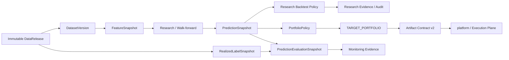

# Architecture

`qlib-platform` is the Research Plane / Alpha Factory. It owns reproducible research from immutable data input through target-portfolio publication, while the sibling `magic-alt/platform` owns authoritative execution semantics.

## System view



The feedback branch is deliberately a side branch. `RealizedLabelSnapshot` and `PredictionEvaluationSnapshot` are monitoring evidence; they do not sit on the promotion path and cannot authorize candidate selection, deployment or publication.

## Logical layers

| Layer | Responsibility | Representative implementation |
| --- | --- | --- |
| Release intake | publish/import/verify immutable upstream facts | `releases/`, `data_release.py` |
| Dataset materialization | convert a release into an immutable Qlib dataset and registry identity | `dataset_manifest.py`, `dataset_registry.py`, `dataset_resolver.py` |
| Feature / PIT | causal normalization, PIT features, processors and reusable feature snapshots | `feature_store.py`, `fundamentals.py`, `processors.py` |
| Research | model fitting, fixed/walk-forward OOS studies, diagnostics and gates | `train_select.py`, `research/`, `research_gate.py` |
| Research portfolio | Qlib simulation strategy, accounting, audit and target-weight construction | `qlib_strategies.py`, `strategy_factory.py`, `strategy_audit.py`, `trade_plan.py` |
| Artifact handoff | export one DataRelease-bound research graph and durably queue it | `research_bundle_export.py`, `platform_adapter.py` |
| Local model operations | refit approved research recipes, select local deployments, generate live signals | `production_refit.py`, `model_registry.py`, `live_inference.py`, `daily_signal_runner.py` |
| Feedback / observability | immutable realized-label evaluation and local operational state | `feedback/`, `ops_state.py`, `delivery_ledger.py` |

The module names above are orientation aids, not public API guarantees. The normative contracts are the identities, manifests and command surfaces documented here.

## Two deployment modes

### Standalone

`configs/pipeline.standalone.yaml` is the CLI default. Configuration, local auth, health and local research do not require `platform` or a TuShare credential. Data can be imported from an existing Qlib provider, built from local governed inputs, or downloaded from TuShare when credentials are configured.

### Integrated

`configs/pipeline.integrated.yaml` explicitly consumes a Platform-produced immutable `DataRelease`. The release is verified before materialization; research then pins the resulting `DatasetVersion`. `platform` availability is not a requirement for already-materialized local research.

See [Configuration](configuration.md) and [Standalone Sovereignty](standalone_sovereignty.md).

## Identity flow

The main governed research chain is:

```text
DataRelease
  -> DatasetVersion
  -> FeatureSnapshot
  -> PredictionSnapshot / research manifest / MODEL_RELEASE
  -> research-backtest evidence
  -> PortfolioPolicy
  -> TARGET_PORTFOLIO
  -> Artifact Contract v2
```

These identities are not interchangeable. In particular:

- a `DataRelease` identifies upstream facts;
- a `DatasetVersion` identifies one immutable Qlib materialization;
- `--dataset-ref` consumes a DatasetVersion ID/alias, not a DataRelease ID;
- `TARGET_PORTFOLIO` is the sole artifact that crosses into execution semantics.

See [Identity and Lineage](identity_and_lineage.md).

## Research Plane boundary

Owned here:

- immutable research data publication/import and verification;
- Qlib dataset materialization and registry aliases;
- PIT features, labels, folds, models and walk-forward research;
- research-only Qlib backtests and simulated fills;
- IC/RankIC, stability, regime, attribution and explanation evidence;
- research portfolio policy and `TARGET_PORTFOLIO` construction;
- local model bundles, local signal generation and monitoring evidence;
- Artifact Contract v2 export, durable outbox and acknowledgement tracking;
- promotion no further than `RESEARCH_PROMOTED`.

Not owned here:

- authoritative LEAN execution validation;
- hard-risk enforcement;
- OMS, QMT/broker connectivity, order lifecycle, fills, positions or ledger;
- paper/shadow/production account state;
- `LEAN_VALIDATED`, `PAPER`, `PRODUCTION` or `RETIRED` lifecycle transitions.

The normative ownership contract is [Architecture Boundary](architecture_boundary.md).

## Failure model

The platform intentionally distinguishes availability from integrity:

- **fail closed on identity/integrity** — schema, parent binding, hashes, causal timing, fold isolation and required capabilities must verify;
- **fail soft on optional external availability** — `platform`, TuShare and notification endpoints may be degraded without making the local research process itself unhealthy;
- **immutable evidence over repair-in-place** — a mismatch creates a new version/run or blocks the operation; published manifests and payloads are not edited to make verification pass;
- **explicit state-changing commands** — publishing, promotion, refit/deploy, live signal generation, outbox delivery and governed diagnosis require explicit targets.

Operational handling is documented in [Operations Runbook](OPERATIONS_RUNBOOK.md) and [Recovery](operations/recovery.md).
